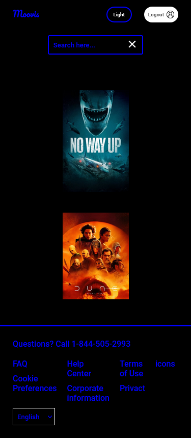
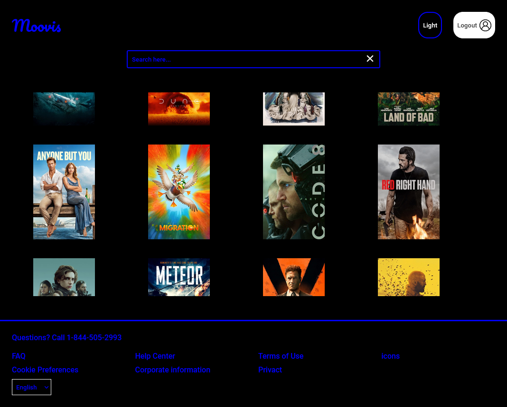
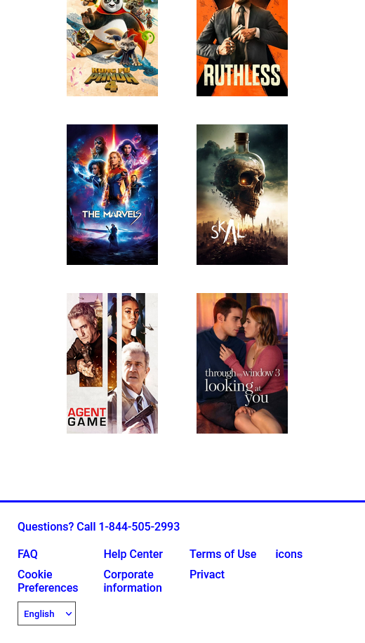
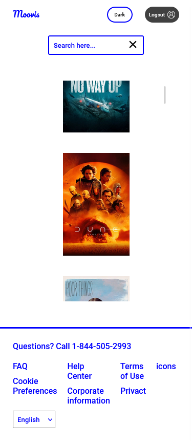
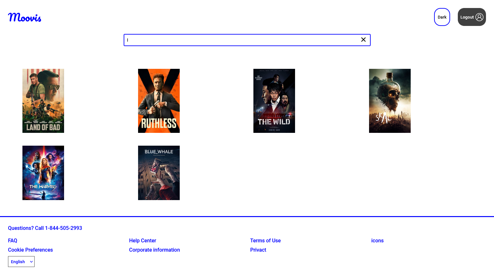

# Moovis App with React (Work in Progress)

Welcome to the Movie App repository! This project is currently a work in progress. The Movie App is a React application designed to display a list of movies along with their details and images. To enhance user experience and ensure security, the app requires users to sign in. New users can easily sign up for an account, and their data will be securely stored using local storage. Additionally, the app utilizes protected routes to restrict unauthorized access to certain pages.

## Dark Mode

The Moovis App offers a dark mode option for users who prefer a darker interface. Below is an example of the app's dark mode:

## Light Mode

In addition to dark mode, the Moovis App also features a light mode for users who prefer a brighter interface. Below is an example of the app's light mode:

## Features

- **User Authentication:** Users can sign in to access the app and view the list of movies.
- **User Registration:** New users can easily sign up for an account.
- **Local Storage:** User data is stored securely using local storage.
- **Protected Routes:** Unauthorized users are redirected away from certain pages.
- **Search Component:** Users can search for specific movies using the search feature.
- **Sign Out Functionality:** User data is removed from local storage upon signing out.

## Technologies Used

- React
- Context API
- Custom Hooks
- Movie API Integration: Fetching movie data from an external 
